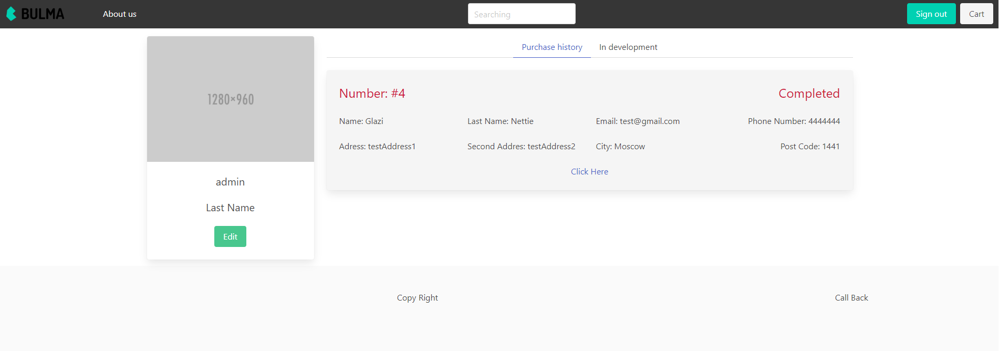
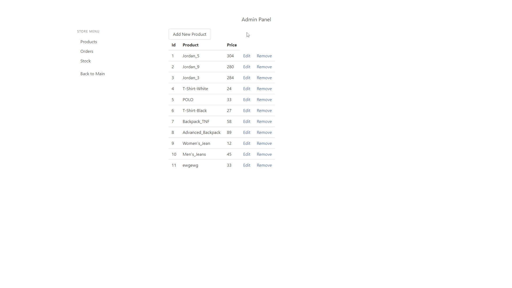
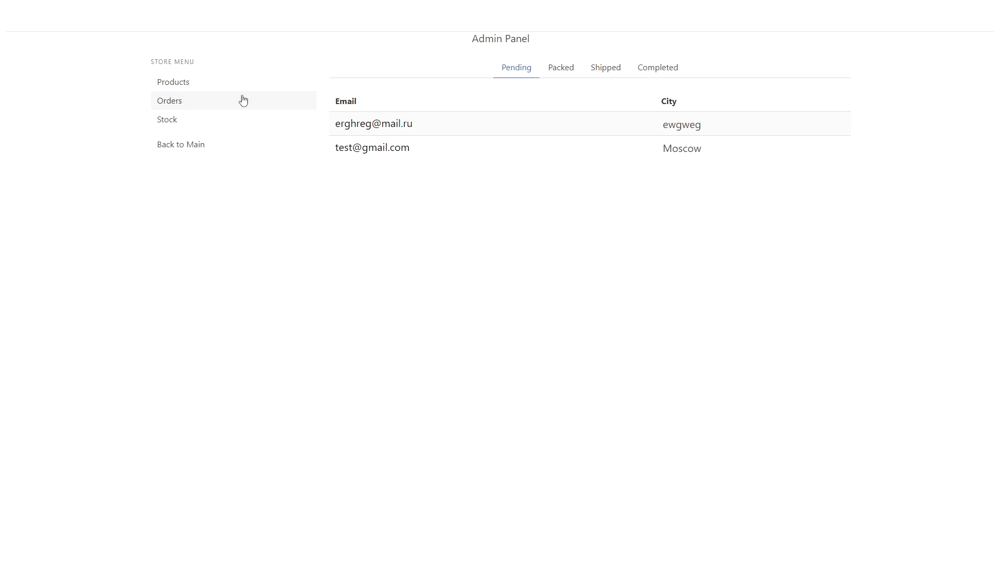
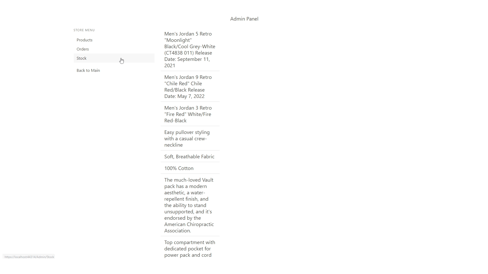

# <p align="center">Проект представляет тестовый *Online Shop*, написанный для демонстрации моих способностей. </p> 

Проект написан на **ASP NET CORE 3.1**. Шаблон - **Razor Page + MVC**. Также для клиентской стороны использовался **Vue js + Axios**, фреймворк для css - **Bulma**. Проект состоит из многоуровневой архитектуры.

 _Данный проект находится в разработки и имеет некоторые баги, которые будут фикситься со временем_. 

> Моя главная цель заключается в изучении ASP.NET CORE, но никак не Vue js, верстки или красивых стилей, поэтому возможны погрешности в этих сферах.   

## Как работать с сайтом

После копирования проекта к себе на устройство, вам необходимо выполнить *миграции* для создания Базы данных.</br> Откройте решения проекта в *Visual Studio*. Далее необходимо открыть _Консоль диспетчера пакетов_ и выполнить ряд команд:</br>
``` 
Add-Migration NameOfMigration
```
Далее:
```
Update-Database
```
Далее можно запускать проект.
> Более подробную информацию о миграциях вы можете узнать здесь: **https://learn.microsoft.com/ru-ru/ef/core/managing-schemas/migrations/?tabs=vs**.

## Инструкция по сайту

### _Список URl адресов_ 
1. `/Main/Main` *- начальное представление.* **Уровень доступности** *- все пользователи.*
2. `/Main/Product/ + "название продукта"` *- представление для подробной информации о товаре и формой для добавления в корзину.* **Уровень доступности** *- все пользователи.*
3. `/Main/Cart` *- представление для корзины продуктов.* **Уровень доступности** *- все пользователи.*
4. `/Checkout/CustomerInformation` *- представление для заполнения информации о покупателе.* **Уровень доступности** *- все пользователи, при условии, что в корзине есть продукты.*
5. `/Checkout/Payment` *- представление с кнопкой создать заказ.* **Уровень доступности** *- все пользователи, при условии, что в корзине есть товары и заполнена информация о покупателе.*
6. `/Account/Login` *- представление для входа в аккаунт.* **Уровень доступности** *- все пользователи.*
7. `/Account/Register` *- представление для регистрации аккаунта.* **Уровень доступности** *- все пользователи, при условии, что пользователь в данный момент не вошёл в аккаунт.*
8. `/Account/PersonalPlace` *- представление для предоставления личной информации о пользователе, а также истории заказов.* **Уровень доступности** *- авторизованный пользователи.*
9. `/Admin/Product` *- представление для управления продуктами.* **Уровень доступности** *- роль Admin.*
10. `/Admin/Stock` *- представление для управления stock.* **Уровень доступности** *- роль Admin.*
11. `/Admin/OrderManagement` - *представление для управления заказами.* **Уровень доступности** *- роль Admin.*


## Покупка товаров

**Как приобрести товар:**


_После этого заказ будет создан. Узнать информацию о заказе можно в Базе Данных, таблице - Order._

_Но если на момент создания заказа вы находились в своей учетной записи, то вы можете просмотреть информацию о вашем заказе (и предыдущих заказах) в своем личном кабинете, перейдя по URL:_ `/Account/PersonalPlace`.



## Управления товарами и заказами

_Для того, чтобы получить доступ к админ панели, нам необходимо авторизоваться в аккаунт с ролью админа. Для этого переходим в_ `/Account/Login`.

*Логин* - `admin`

*Пароль* - `password`

_**Вы можете добавить свой продукт, или изменить имеющий, или вовсе удалить:**_



_**Вы можете изменять статус заказа:**_




_**Вы можете добавить к продукту stock или изменить сразу несколько stock, или вовсе удалить их:**_



## Планы по улучшению проекта

### Глобальные планы

1. **Переписать фронт целиком на vue js**

### Цели

1. **Фотографии для всех стоков**
2. **Добавить управления пользователями для админа и возможность выдавать роли**
3. **Сделать поисковик**
4. **В личном кабинете доработать историю заказов**
5. **Переписать категории и фильтры, чтобы они не нарушали принципов SOLID**


> При обнаружении багов или идеи по улучшению проекта буду рад услышать: https://t.me/Miraclee_888


